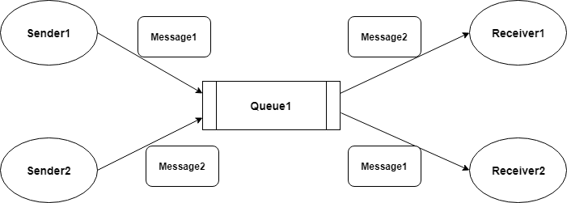
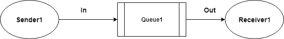
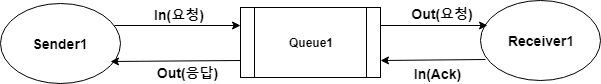
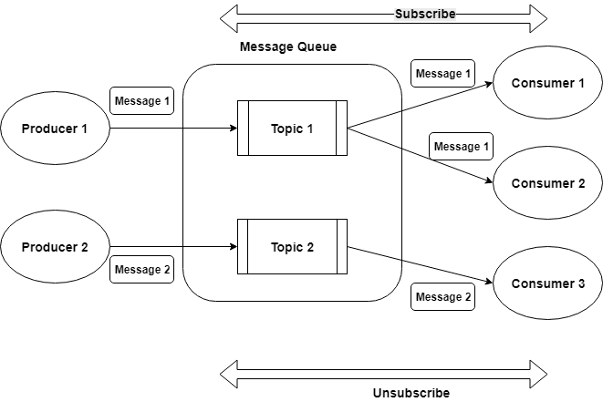
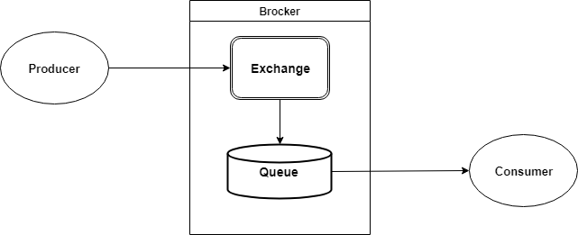

# 01.메시징 시스템 소개

## 목표  

- 우수한 메시징 시스템 설계를 위한 기본 원칙
- 메시징 시스템의 동작 원리
- 지점 간(point-to-point) 메시징 시스템
- 게시/구독(publish-subscribe) 메시징 시스템
- AMQP 메시징 시스템
- 스트리밍 APP을 설계할 경우에 필요한 메시징 시스템  

---  

> ### 메시징 시스템의 기본 원칙  

**애플리케이션을 통합하는 시스템을 설계할 경우 유념해야 할 원칙**  

- 느슨한 연계(loose coupling)  
; 상호 간의 의존성을 최소화
- 공용 인터페이스(common interface) 정의  
; 애플리케이션 간 데이터 교환을 위해서 공용으로 규정 된 데이터 형식을 보장
- 응답속도(latency)  
; 메시지 전송부터 수신까지 소요되는 시간  
- 신뢰성(reliability)  
; 일시적인 가용성 문제가 발생해도 정보를 교환하는 관련 애플리케이션에  
영향을 주지 않는 다는 것  

> ### 메시징 시스템의 이해  

애플리케이션의 통합은 개별 애플리케이션에 관련된 기능을 포괄하는 세트로 만들어 내는 것이 핵심  
=> 애플리케이션 간에 주기적으로 정보를 공유할 필요가 있음  
=> 원격 프로시저 호출(RPC, remote procedure calls), 공유 데이터베이스(shared database)  
, 웹 서비스 호출(invocation) 등이 존재  

e.g) 공유 데이터베이스를 사용할 경우 하나의 애플리케이션 변경을 다른 애플리케이션의 변경을 야기  
=> 통합하는 방법을 결론짓기 전에 앞에 설명된 모든 원칙을 검토해봐야 함  

**기본적인 메시징 개념**  

- **메시지 큐**  
: 송신과 수신을 위한 애플리케이션 사이의 연결고리  
=> 소스 프로그램으로부터 받은 메시지 패킷을 수신 & 수신 프로그램으로 주기적이고 신뢰할 수 있는 방법으로 보내는 것이 핵심  
- **메시지(데이터 패킷)**  
: 네트워크를 통해 메시지 큐로 보내는 단위 데이터 패킷  
송신 프로그램 : 데이터를 더 작은 데이터 패킷 단위로 쪼개고 프로토콜과 헤더 기반으로 wrapping  
수신 프로그램 : 메시지 wrapper에서 데이터 추출  
- **센더(프로듀서)**  
: 특정 목적지로 보내야 하는 데이터 소스(메시지 큐의 종점 endpoint에 연결 생성 & 공통 인터페이스 표준에 맞게  
더 작은 메시지 패킷으로 데이터 전송, 배치 또는 하나씩 보내는 방식 등 결정)  
- **리시버(컨슈머)**  
: 센더 애플리케이션에 의해 전송된 메시지를 수신(메시지 큐에서 데이터를 가져오거나 지속적인 연결을 통해  
메시지 큐에서 데이터를 받음)  
- **데이터 전송 프로토콜**  
:애플리케이션 간에 메시지 교환을 통제하는 규칙을 결정  
큐잉 시스템은 각각 다른 데이터 전송 프로토콜을 사용  
AMQP(Advanced Message Queueing Protocol), STOMP(Streaming Text Oriented Message Protocol), MQTT(Message Queue Telemetry Transport),  
HTTP(Hypertext Transfer Protocol)  
- **전송모드**  
: 데이터가 소스 프로그램에서 수신 프로그램으로 전송되는 방법에 따라 정리(비동기 모드, 배치 모드 등)  

> ### 지점 간 메시징 시스템  
; PTP(Point To Point) 메시징 모델에서는 메시지 프로듀서가 센더가 되고 컨슈머는 리시버가 됨  

=> 하나의 메시지 컨슈머에 의해 수신된 단일 메시지가 주로 사용됨  

> 지점 간 메시징 모델 동작 방식
  

=> 큐는 메시지 오프셋(offset)을 유지함. 메시지를 삭제하는 대신에 리시버에 대한 오프셋을 더하며,  
오프셋에 기초한 모델은 메시지 재연(reply)을 더 원할하게 지원  

- 한 개 이상의 센더가 큐로 메시지를 전송할 수 있음  
- 한 개 이상의 리시버가 큐에서 메시지를 사용할 수 있지만, 각각의 메시지는 오직 하나의 리시버에 의해 사용됨  
(메시지 큐 확장)  
- 리시버는 하나의 연결을 공유하거나 다른 연결을 사용하지만, 모두 동일한 큐에 접근이 가능  
(메시지 큐 확장)  
- 센더와 리시버는 시간 제약이 없음(즉 리시버는 센더의 동작 여부에 상관없이 메시지를 사용할 수 있음)  
- 메시지는 생성된 순서에 맞게 큐에 배치되지만, 메시지가 사용되는 순서는 메시지의 유효기간, 우선순위,  
셀렉터(selector)가 메시지 사용에 관여하는지, 컨슈머의 관련 메시지 처리율(processing rate) 등에 영향을 받음  
- 센더와 리시버는 실행 중에 동적으로 추가 삭제 될 수 있으므로 필요에 따라 추가로 확장하거나 등록할 수 있음  

**PTP 메시징 시스템의 2가지 유형**  

> Fire-and-forget 모델  

  

=> Producer가 중앙 집중형 큐에 메시지를 보내고 즉각적인 ACK를 대기하지 않음  

> 비동기 요청/응답 메시지 모델  

  

=> 메시지 센더가 하나의 큐에 메시지를 보내고 나면, 리시버에서 응답을 기다리는 응답 큐에 대기(blocking wait)  
=> 센더와 리시버 간에 높은 수준의 디커플링(decoupling)을 제공하는데, 메시지 Producer와 Consumer 요소가 전혀 다른  
언어의 플랫폼으로 구성될 수 있게 지원  

**PTP 메시징 모델을 어디에 사용할 수 있을 지?**  

=> PTP 모델을 주어진 메시지를 오직 한 번만 리시버가 처리하도록 구성할 때 사용  
=> 서로 다른 플랫폼이나 프로그래밍 언어로 작성된 구성 요소 간에 동기식(asynchronous) 통신이 필요한 경우  
e.g) PHP로 작성한 프로그램이 트윗을 분석할 목적으로 자바로 작성된 트위터 프로그램과 통신하기를 원할 때 등  

> ### 게시-구독 메시징 시스템  

; 구독자(Subscriber)가 특정 토픽 OR 이벤트에 대해서 어떤 구독 의사(interest)를 등록하고 해당 이벤트에 대한 일련의  
통지(Publisher에 의해 생성 된)를 비동기 방식으로 받는 것  
=> 다중 리시버를 보유할 수 있다는 점과 모든 리시버가 각각의 메시지 사본을 받을 수 있다는 점에서 PTP와 다름  
=> 메시지는 리시버가 토픽에서 꺼내 오지 않고, 모든 리시버에 브로드캐스트(broadcast)  

> 게시/구독 메시징 모델  

  

=> 이벤트 서비스를 일반적으로 큐라고 부름
=> 이런 상호 작용은 이벤트 저장소, 통보 서비스, 구독 관리, 목적지로 효과적 & 확실한 이벤트 전송 등을  
제공하는 서비스가 필요  
=> 큐는 Event Producer와 Event Consumer 사이에서 중립적인 조정자 역할을 함  

- 메시지는 토픽으로 정의된 채널을 통해 공유 됨  
- 각각의 메시지는 한 개 또는 그 이상의 메시지 컨슈머, 즉 구독자에게 전달
- 게시자는 어느 구독자가 토픽의 메시지를 받게 되는지 모름
- 메시지는 컨슈머에게 푸쉬
- 프로듀서와 컨슈머는 연결이 저징(coupling)된 관계가 아님  
=> 구독자와 게시자는 실행 중에 추가될 수 있음  
- 토픽을 구독 중인 모든 클라이언트는 해당 토픽에 게시된 메시지 사본을 수신함  

e.g) 애플리케이션이나 시스템 구성 요소에서 예외가 발생할 때마다 토픽으로 알리는 경우  
=> Producer는 어떻게 쓰일 지에 상관없이 메시지만 생성  
=> 메일 발송, 호출기로 알림 등 다양하게 Consumer 사용  

> ### AMQP(Advanced Message Queueing Protocol)  

: 센더, 리시버, 메시지 큐 간에 메시지를 전달하는 데이터 전송 프로토콜은 동일하지 않음  
=> AMQP 예를 들어 설명  

> AMQP 구조  

  

=> 프로듀서는 메시지를 중개 역할을 하는 브로커에 보냄  
=> 브로커는 컨슈머에게 순서대로 전달  

**AMQP 메시징 시스템의 3가지 주요 구성 요소**  

- 게시자
- 컨슈머
- 브로커/서버  

=> 각 구성 요소는 한 개 이상으로 존재할 수 있음 & 독립적인 호스트에 위치할 수 있음  

- **직접교환**  
: 키(key)를 사용한 라우팅 방식. 메시지는 메시지의 라우팅 키와 동일한 이름의 큐로 전달
- **팬 아웃(fan-out) 교환**  
: 라우팅 키가 무시되고, 교환 가능한 범위내에서 모든 큐에 대해 메시지 경로를 설정  
=> N개의 큐가 팬 아웃 교환의 범위에 있다면 새로운 메시지가 게시될 때, 사본이 N개의 큐 모두에게 전달  
=> 메시지를 브로드캐스트 형태로 라우팅하기에 적합(메시지는 해당 교환기에 연결된 모든 큐에 복제돼 전송)  
- **토픽 교환**  
: 와일드 카드를 사용해서 일부 연결된 큐로 메시지 경로를 설정하는 방식  
=> 메시지의 멀티캐스트(multicast) 라우팅에 사용

---  