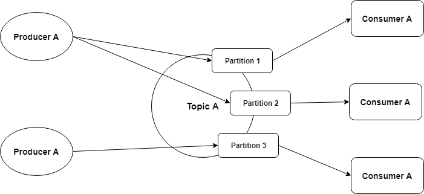
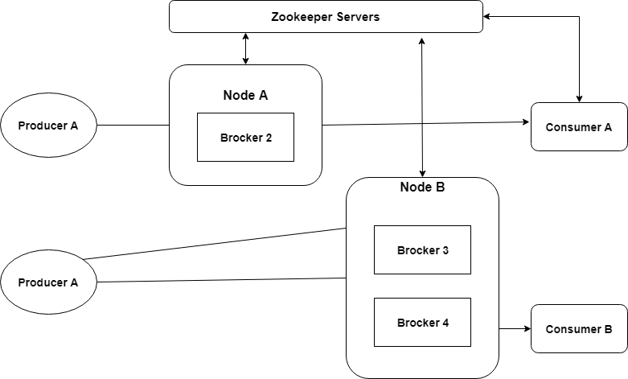

# 02 카프카소개, 분산 메시징 플랫폼  

## 목표  

- 카프카의 유래
- 카프카 구조
- 메시지 토픽
- 메시지 파티션
- 복제(replication)와 복제 로그
- 메시지 프로듀서
- 매시지 컨슈머
- 주키퍼(Zookeeper) 역할  

---  

> ### 카프카의 유래  

아래의 목표를 가지고 개발 됨

- 메시지 프로듀서와 컨슈머의 느슨한 관계  
- 다양한 형태의 데이터 사용 시나리오, 장애 처리 지원을 위한 메시지 데이터 유지  
- 빠른 처리 시간을 지원하는 구성요소로 시스템의 전반적인 처리량을 최대화  
- 이진 데이터 형식을 사용해서 다양한 데이터 형식과 유형을 관리  
- 기존의 클러스터 구성에 영향을 주지 않고 일정한 서버의 확장성 지원  

---  

> ### 카프카의 구조  

> 카프카의 논리적 구조  

  

=> 카프카 토픽에서 모든 메시지는 바이트의 집합(배열로 표현)  
=> 프로듀서는 카프카 큐에 정보를 저장하는 애플리케이션  
=> 프로듀서는 카프카 토픽으로 메시지를 전송(토픽은 파티션으로 더 나뉘어 짐)  
=> 프로듀서는 로그 선행 기입 파일(WAL, write-ahead logging) 마지막에 메시지를 추가  
=> 컨슈머는 토픽 파티션에 속한 로그 파일에서 메시지를 가져옴  

> 카프카의 물리적 구조  

  

=> 카프나 클러스터는 다중 브로커로 구성됨  
(클러터에 대한 메시지 읽기와 쓰기 작업의 부하 분산(load-balancing)을 도움)  
=> 각 브로커는 상태를 저장하지 않지만(stateless) 주키퍼를 사용해 상태 정보(state)를 유지  
=> 각각의 토픽 파티션에서는 리더(leader)로 활동하는 브로커가 하나씩 있고 0개 이상의 팔로워(follower)가 존재  
(리더는 해당 파티션의 읽기나 쓰기 요청을 관리, 팔로워는 리더의 작업을 최대한 간섭하지 않으면서  
백그라운드에서 해당 리더를 복제)  
=> 리더에 대한 백업으로 팔로워를 구성하는 것을 염두에 두고, 팔로워 중에 하나가 리더의 장애 시에  
대체할 수 있도록 고려해야 함  
=> 주키퍼는 카프카 브로커와 컨슈머를 관리하고 조정함  

=> 프로듀서는 브로커에게 데이터를 푸시  
=> 데이터를 게시하는 시점에 프로듀서는 해당 토픽 파티션의 선정된 리더(브로커)를 검색하고,  
자동으로 해당 리더 브로커의 서버에 메시지를 전송  
=> 비슷한 방식으로 컨슈머는 브로커에서 메시지를 읽음  

=> 컨슈머는 상태 정보를 주키퍼의 도움으로 기록  
=> 브로커는 상태 정보를 관리하지 않음(이러한 설계가 카프카의 확장성 지원)  
=> 컨슈머는 파티션 오프셋을 사용해 얼마나 많은 메시지가 사용됐는지 기록  

---  

> ### 메시지 토픽  

=> 데이터베이스의 테이블(토픽), 데이터 쓰기(프로듀서), 데이터 읽기(컨슈머)와 비슷  

*용어*  

- 보유(retention) 기간  
; 공간 절약을 위해 정해진 기간 동안만 저장할 필요 있음  
=> 카프카는 정해진 기간 동안 메시지를 보관하고 나서 삭제함  
- 공간 유지 정책(space retention policy)  
; 메시지의 크기가 설정된 임계값에 도달하면 메시지를 지우도록 설정할 수 있음  
- 오프셋  
; 각 파티션은 도착한 순서에 따라 메시지를 저장  
=> 컨슈머는 오프셋으로 메시지를 인식하며, 이는 특정 오프셋 이전의 메시지는  
컨슈머가 수신했음을 의미  
- 파티션  
; 단위 카프카 토픽은 고정된 숫자의 파티션으로 구성 됨(카프카에서 토픽을 생성하는 동안  
파티션 수를 설정해야 함)  
- 압축(compaction, 0.8 버전에서 소개 됨)  
; 이전에는 메시지를 변경할 방법이 없고, 보유 기간이 지나면 삭제 됨  
=> 압축 기능은 동일키를 가진 모든 메시지를 압축하고 키에 대한 맵을 생성  
- 리더  
; 파티션은 지정된 복제 팩터(factor)에 따라 카프카 클러스터 전역에 걸쳐 복제 됨  
=> 각 파티션은 리더 브로커와 팔로워를 가지며, 파티션에 대한 모든 읽기와 쓰기 요청은  
리더를 통해서만 진행됨(리더에 장애 발생 -> 다른 리더가 선정됨)  
- 버퍼링(buffering)  
; 프로듀서와 컨슈머 양쪽의 카프카 버퍼 메시지는 처리 속도를 향상 & 입출력 빈도를 줄임  

---  

> ### 메시지 파티션  

구매 테이블 > 전자제품 같은 특정 카테고리 하나의 제품에 대한 레코드 읽기를 읽는다 가정,    
선택한 기록을 빨리 읽기 위해 테이블을 파티션으로 나누면 ?  
=> 카프카에서 병렬 처리를 위한 단위로 알려진 파티션으로 구분  

**파티션 수를 증가시킬 경우의 장/단점**  

- 높은 처리량(throughput)  
;  

---  

          
