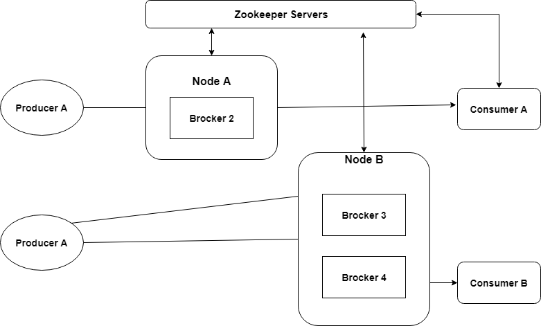

# 02 카프카소개, 분산 메시징 플랫폼  

## 목표  

- <a href="#카프카_유래">카프카 유래</a>
- <a href="#카프카_구조">카프카 구조</a>
- <a href="#메시지_토픽">메시지 토픽</a>
- <a href="#메시지_파티션">메시지 파티션</a>
- <a href="#복제와_복제로그">복제(replication)와 복제 로그</a>
- <a href="#메시지_프로듀서">메시지 프로듀서</a>
- <a href="#메시지_컨슈머">매시지 컨슈머</a>
- <a href="#주키퍼_역할">주키퍼(Zookeeper) 역할</a>
- <a href="#요약">요약</a>  

---  

  

> ### 카프카의 유래  

아래의 목표를 가지고 개발 됨

- 메시지 프로듀서와 컨슈머의 느슨한 관계  
- 다양한 형태의 데이터 사용 시나리오, 장애 처리 지원을 위한 메시지 데이터 유지  
- 빠른 처리 시간을 지원하는 구성요소로 시스템의 전반적인 처리량을 최대화  
- 이진 데이터 형식을 사용해서 다양한 데이터 형식과 유형을 관리  
- 기존의 클러스터 구성에 영향을 주지 않고 일정한 서버의 확장성 지원  

---  

  

> ### 카프카의 구조  

> 카프카의 논리적 구조  

  

=> 카프카 토픽에서 모든 메시지는 바이트의 집합(배열로 표현)  
=> 프로듀서는 카프카 큐에 정보를 저장하는 애플리케이션  
=> 프로듀서는 카프카 토픽으로 메시지를 전송(토픽은 파티션으로 더 나뉘어 짐)  
=> 프로듀서는 로그 선행 기입 파일(WAL, write-ahead logging) 마지막에 메시지를 추가  
=> 컨슈머는 토픽 파티션에 속한 로그 파일에서 메시지를 가져옴  

> 카프카의 물리적 구조  

  

=> 카프나 클러스터는 다중 브로커로 구성됨  
(클러터에 대한 메시지 읽기와 쓰기 작업의 부하 분산(load-balancing)을 도움)  
=> 각 브로커는 상태를 저장하지 않지만(stateless) 주키퍼를 사용해 상태 정보(state)를 유지  
=> 각각의 토픽 파티션에서는 리더(leader)로 활동하는 브로커가 하나씩 있고 0개 이상의 팔로워(follower)가 존재  
(리더는 해당 파티션의 읽기나 쓰기 요청을 관리, 팔로워는 리더의 작업을 최대한 간섭하지 않으면서  
백그라운드에서 해당 리더를 복제)  
=> 리더에 대한 백업으로 팔로워를 구성하는 것을 염두에 두고, 팔로워 중에 하나가 리더의 장애 시에  
대체할 수 있도록 고려해야 함  
=> 주키퍼는 카프카 브로커와 컨슈머를 관리하고 조정함  

=> 프로듀서는 브로커에게 데이터를 푸시  
=> 데이터를 게시하는 시점에 프로듀서는 해당 토픽 파티션의 선정된 리더(브로커)를 검색하고,  
자동으로 해당 리더 브로커의 서버에 메시지를 전송  
=> 비슷한 방식으로 컨슈머는 브로커에서 메시지를 읽음  

=> 컨슈머는 상태 정보를 주키퍼의 도움으로 기록  
=> 브로커는 상태 정보를 관리하지 않음(이러한 설계가 카프카의 확장성 지원)  
=> 컨슈머는 파티션 오프셋을 사용해 얼마나 많은 메시지가 사용됐는지 기록  

---  

  

> ### 메시지 토픽  

=> 데이터베이스의 테이블(토픽), 데이터 쓰기(프로듀서), 데이터 읽기(컨슈머)와 비슷  

*용어*  

- 보유(retention) 기간  
; 공간 절약을 위해 정해진 기간 동안만 저장할 필요 있음  
=> 카프카는 정해진 기간 동안 메시지를 보관하고 나서 삭제함  
- 공간 유지 정책(space retention policy)  
; 메시지의 크기가 설정된 임계값에 도달하면 메시지를 지우도록 설정할 수 있음  
- 오프셋  
; 각 파티션은 도착한 순서에 따라 메시지를 저장  
=> 컨슈머는 오프셋으로 메시지를 인식하며, 이는 특정 오프셋 이전의 메시지는  
컨슈머가 수신했음을 의미  
- 파티션  
; 단위 카프카 토픽은 고정된 숫자의 파티션으로 구성 됨(카프카에서 토픽을 생성하는 동안  
파티션 수를 설정해야 함)  
- 압축(compaction, 0.8 버전에서 소개 됨)  
; 이전에는 메시지를 변경할 방법이 없고, 보유 기간이 지나면 삭제 됨  
=> 압축 기능은 동일키를 가진 모든 메시지를 압축하고 키에 대한 맵을 생성  
- 리더  
; 파티션은 지정된 복제 팩터(factor)에 따라 카프카 클러스터 전역에 걸쳐 복제 됨  
=> 각 파티션은 리더 브로커와 팔로워를 가지며, 파티션에 대한 모든 읽기와 쓰기 요청은  
리더를 통해서만 진행됨(리더에 장애 발생 -> 다른 리더가 선정됨)  
- 버퍼링(buffering)  
; 프로듀서와 컨슈머 양쪽의 카프카 버퍼 메시지는 처리 속도를 향상 & 입출력 빈도를 줄임  

---  

  

> ### 메시지 파티션  

구매 테이블 > 전자제품 같은 특정 카테고리 하나의 제품에 대한 레코드 읽기를 읽는다 가정,    
선택한 기록을 빨리 읽기 위해 테이블을 파티션으로 나누면 ?  
=> 카프카에서 병렬 처리를 위한 단위로 알려진 파티션으로 구분  

**파티션 수를 증가시킬 경우의 장/단점**  

- 높은 처리량(throughput)  
;  파티션은 카프카에서 병렬 처리를 지원하도록 구성하는 방안  
=> 여러 파티션에 대한 쓰기 동작은 동시에 진행 됨  
- 메모리 증가  
; 프로듀서는 파티션마다 들어오는 메시지를 버퍼에 보관  
=> 일정 시간 설정에 도달하면 프로듀서는 브로커에게 메시지를 보내고 버퍼에서 지움  
=> 파티션수를 증가시키면, 버퍼링을 위해 할당된 메모리가 일시적으로 과도해질 수 있음  
- 고가용성 문제  
1) 파티션의 리더에 장애 발생  
=> 새로운 리더가 수 밀리초 안에 선정 & 컨트롤러(컨트롤러는 브로커 중에 하나)를 통해 장애 여부를 관찰  
(지연시간 = 파티션 OR 복제 개수 X 단일 파티션의 메타데이터를 읽는 시간)  
2) 문제가 발생한 브로커(컨트롤러)  
=> 새로운 컨트롤러는 각 파티션의 메타데이터를 읽고, 컨트롤러를 시작하는 시간의 경우 파티션 수에 비례  

---  

  

> ### 복제와 복제 로그   

  
https://kafka.apache.org/documentation/#log  

; 각 토픽 파티션에 대한 메시지 로그의 복제본은 카프카 클러스터 내의 여러 서버에 걸쳐서 관리되고  
구분된 개별 토픽에 대해서 설정이 가능  

=> 일반적으로 팔로워는 리더의 로그 복사본을 보관  
== 리더가 모든 팔로워로부터 ACK를 받기 전까지 메시지를 커밋(commit)하지 않음  

=> 복제본의 일관성을 유지하는 방법  

- 쿼럼(quorum) 기반 방식  
; 다수 OR 과반수의 복제본(replicas)이 메시지를 수신했다는 ACK를 갖는 경우에만 리더가  
메시지를 커밋된 것으로 표시하는 방식(주키퍼의 리더 선정 방식)  

- 주 백업(primary backup) 방식  
; 카프카 리더는 메시지를 커밋된 상태로 표시하기 전에 모든 팔로워로부터 ACK를 기다림  
=> 처리 시간과 처리량에 대해서 부담이 생기지만, 메시지와 데이터에 대한 더 나은 일관성 보장  
=> 각 리더는 ISR(in sync replica)로 표기되는 인 싱크 복제 세트를 기록  
(한 개의 리더와 주키퍼에 ISR을 갖는다는 의미)  

- 쓰기  
; 모든 리더와 팔로워는 로그 끝부분을 나타내는 오프셋을 유지하면서 자신만의 지역로그(local log)를 갖음  
=> 커밋된 최신 메시지의 오프셋을 하이 워터마크(high watermark)라고 함  
=> 메시지 쓰기 요청 -> 주키퍼로부터 해당 파티션의 리더를 확인 + 쓰기 요청  
-> 리더는 로그에 메시지를 쓰고 ACK를 반환하는 ISR 안의 팔로워를 기다림  
-> ACK을 받으면 하이 워터마크를 가리키는 포인터를 증가 & 클라이언트로 ACK를 보냄  
(ISR 안의 팔로워 중 일부가 장애를 발생시키면, ISR에서 해당 팔로워 제외.  
장애가 회복되면 로그를 동기화해서 리더와 작업을 재개 & ISR에 해당 팔로워 추가)  

- 읽기  
; 모든 읽기 작업은 리더를 통해서만 발생  
=> 리더에 의해 ACK가 확인된 메시지는 클라이언트가 읽을 수 있도록 가용한 상태가 됨  

---  

  

> ### 메시지 프로듀서  

; 데이터를 생성하기 위한 해당 토픽의 파티션으로 데이터를 보낼 책임을 가지고 있음  
=> 프로듀서는 메시지에 대한 쓰기 요청을 생성해 리더 브로커에게 전송  
(파티셔너(partitioner)가 메시지의 해시 값을 계산하여 어떤 파티션을 선택해야 하는지 지원)  

=> 메시지를 키로 해시 값 계산 & 카프카의 토픽으로 메시지를 기록할 때 제공  
(null 키를 갖는 메시지는 분산 메시징을 지원하는 파티션에 대해 라운드 로빈 방식으로 분배)  

=> 프로듀서는 설정에 따라 메시지의 ACK를 기다리며, 일반적으로 특정 메시지에 대한 복제를 완료  
했는지 확인될 때까지 기다림  
(메시지를 커밋해도 된다는 모든 복제본의 확인이 없다면, 읽기 작업은 허용되지 않음  
-> 이러한 설정은 기본 값 & 리더 브로커에 장애가 발생하더라도 메시지 손실이 없음)  

=> 확인 여부(ackowledgement) 설정을 '1'로 할 경우, 리더에 의해 메시지가 커밋되면 읽기를 허용하고  
카프카 프로듀서가 다음 메시지를 생성할 수 있게 함  
(지속성(durability)는 떨어지지만 처리 성능은 좋아짐)  

---  

  

> ### 메시지 컨슈머  

카프카 토픽을 구독하는 것은 모두 컨슈머  
=> 동일한 그룹에 속한 컨슈머는 하나의 파티션으로부터 메시지를 읽을 수 없음(순서가 뒤엉킴, 다른 파티션은 가능)  
=> 다른 그룹은 사용 순서에 영향을 주지 않으면서 병력 방식으로 동일한 파티션의 메시지를 사용할 수 있음  

---  

  

> ### 주키퍼의 역할  

; 카프카 클러스터 상태 정보를 어떻게 기록하는지 이해하는 것 역시 중요  

- 컨트롤러 산정  
; 컨트롤러는 파티션 관리(리더 선정, 토픽 생성, 파티션 생성, 복제본 관리)를 책임지는 브로커 중 하나  
=> 카프카는 컨트롤러를 선정하기 위해 주키퍼의 메타데이터 정보를 활용  
=> 주키퍼는 현재의 컨트롤러가 장애가 나면 새로운 컨트롤러가 선정되는 것을 보장  

- 브로커 메타데이터  
; 카프카 클러스터의 일부인 각 브로커에 대해 상태 정보를 기록  
=> 프로듀서와 컨슈머는 주키퍼와의 상호 작용으로 브로커의 상태 정보를 얻음  

- 토픽 메타데이터  
; 파티션 수, 특정한 설정 파라미터 등의 토픽 메타데이터를 기록  

- 클라이언트 할당(quota) 정보  
; 할당량은 카프카 토픽의 메시지를 읽고 쓰는 클라이언트에 대한 바이트 비율의 임계값을 제한하며  
모든 정보와 상태는 주키퍼가 관리  

- 카프카 토픽 ACLs  
; 카프카는 내장된 인증 모듈, 즉 접근 제어 목록(ACLs, Access Control Lists)을 갖고 있음(주키퍼를 사용)  
=> 이러한 ACLs는 사용자 역할과 관련된 토픽에 대해 읽기와 쓰기 권한 종류를 결정  

---  
