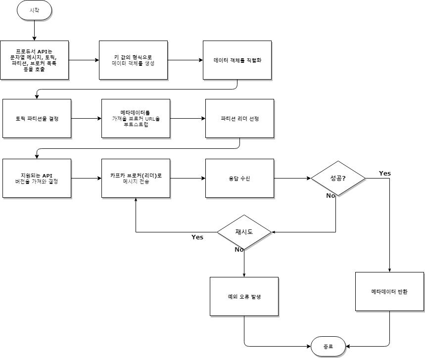

# 03 카프카 프로듀서  
; 카프카는 메시지 큐, 메시지 버스, 데이터 저장 시스템으로 활용 가능  

## 목표  

- <a href="#내부구조">카프카 프로듀서의 내부 구조</a>
- <a href="#프로듀서_API">카프카 프로듀서 API와 활용법</a>
- <a href="#파티션_활용법">파티션과 활용법</a>
- <a href="#프로듀서_추가설정">프로듀서에 대한 추가 설정</a>
- <a href="#프로듀서_예제">프로듀서 예제</a>
- <a href="#">일반적인 프로듀서 유형</a>
- <a href="#">카프카 프로듀서 모범 사례</a>

---  


<div id="내부구조"></div>

> ### 카프카 프로듀서의 내부 구조  

- 카프카 브로커 URL 부트스트랩 하기  
; 프로듀서는 카프카 클러스터에 대한 메타데이터를 가져오기 위해 최소 하나의 브로커에 연결  

- 데이터 직렬화  
; TCP기반의 데이터 송수신을 위해 이진 프로토콜을 사용  
(데이터를 기록할 때 프로듀서는 미리 정의된 카프카 브로커 네트워크 포트에 데이터를 정렬된 바이트 시퀀스로 전송)  

- 토픽 파티션 결정  
; 어떤 파티션으로 데이터를 전송돼야 하는지 결정하는 일은 프로듀서의 책임  
=> Caller에 의해 파티션이 정해진다면 프로듀서 API는 토픽 파티션을 결정하지 않고 직접 데이터 전송  
=> 파티션이 지정되지 않은 경우에는 프로듀서가 메시지에 대한 파티션을 선택  
(특정 파티션에 속하길 원하면 파티셔너(custom partitioner) 코드를 작성 할 수 있음)  

- 처리 실패/재시도 기능  
; 처리 실패 응답이나 재시도 횟수는 프로듀서 애플리케이션에 의해 제어되어야 함  

- 배치 처리  
; 효율적인 메시지 전송을 위해서 배치는 매우 유용한 방식  
=> 프로듀서 API 설정을 통해 프로듀서가 비동기 모드의 사용 여부를 제어할 수 있음  
=> 배치 처리는 입출력 횟수를 줄이고 프로듀서 메모리르 최적화  


  
*(프로그램 언어에 따라 다를 수 있음(스레드 OR 콜백을 사용한 병렬처리 등)*   

=> 카프카 토픽으로 메시지 게시  
== 문자열 형식의 메시지, 파티션(선택적), 브로커 URL 같은 여러 설정 등의 세부 사항을  
프로듀서 API를 호출해 시작  
=> 프로듀서 API는 중첩된 키 값(key-value)의 쌍으로 이뤄진 데이터 객체로 구성된 정보를  
전달받아 바이트 배열로 직렬화(기본 OR 명시 시리얼 라이저)  
=> 데이터가 전송될 파티션 결정(미설정 시 데이터 객체에 정의된 키를 사용해 결정)  
=> 메시지를 보낼 브로커를 결정(부트스트랩 과정)  
=> 메타데이터를 활용해 리더 브로커 결정  
=> 카프카 클러스터에 의해 노출된 API 버전을 사용해 지원되는 API 버전 결정  
=> 직렬화된 데이터가 전달되면, 응답을 수신  
=> 새로운 메시지 오프셋을 사용함에 따라 해당 파티션의 메타데이터를 수신하면  
응답은 곧 성공한 것으로 간주  
=> 오류 코드가 수신되면 예외를 발생시켜 기존에 받은 설정에 따라 재시도를 수행  

---  

<div id="프로듀서_API"></div>

> ### 카프카 프로듀서 API  

1. 필요한 설정
2. 프로듀서 객체 생성
3. 프로듀서 레코드 구성
4. 필요한 경우 사용자 정의 파티션 생성
5. 추가 설정  

> 프로듀서 객체 생성  

```
Properties producerProps = new Properties();
// producerProps.put("bootstrap.servers", "broker1:port,broker2:port");
producerProps.put("bootstrap.servers", "192.168.5.78:9092");

producerProps.put("key.serializer", "org.apache.kafka.common.serialization.StringSerializer");
producerProps.put("value.serializer", "org.apache.kafka.common.serialization.StringSerializer");

KafkaProducer<String, String> producer = new KafkaProducer<String, String>(producerProps);
```  

- 속성 객체  
; 올바른 위치에 키 값을 설정하는 데 사용  
- 직렬화 클래스  
; 키 값 모두에 대해 StringSerializer를 사용하며, 키 값 모두 문자열로 구성  
- 프로듀서 객체  
; 설정 객체를 넘겨주면서 프로듀서 객체 생성  
=> 이후에 다룰 기타 설정을 프로듀서에게 전달  

#### 프로듀서 객체와 ProducerRecord 객체  

=> 프로듀서는 .ProducerRecord 토픽에 레코드를 전송하는 ProducerRecord 객체를 갖는데,  
토픽 이름, 파티션 번호, 타임스탬프, 키 값 등을 포함  
=> 데이터를 보낼 토픽과 데이터 값을 필수

- 파티션 번호가 지정되면 지정된 파티션은 레코드를 전송할 때 사용
- 파티션이 지정되지 않고 키가 지정 된 경우에는 파티션은 키의 해시를 사용해 정함  
- 키와 파티션 모두 지정되지 않은 경우에는 파티션은 라운드 로빈(round-robin) 방식으로 할당  

> ProducerRecord 객체 생성  및 전송

```
KafkaProducer<String, String> producer = createKafkaProducerExample();

String topicName = "topic";
String data = "Temp message";

ProducerRecord<String, String> producerRecord = new ProducerRecord<>(topicName, data);
Future<RecordMetadata> recordMetadata = producer.send(producerRecord);
```  

> ProducerRecord 생성자  

```
public ProducerRecord(String topic, Integer partition, Long timestamp, K key, V value, Iterable<Header> headers) {
    ...
}

public ProducerRecord(String topic, Integer partition, Long timestamp, K key, V value) {
    ...
}

public ProducerRecord(String topic, Integer partition, K key, V value, Iterable<Header> headers) {
    ...
}

public ProducerRecord(String topic, Integer partition, K key, V value) {
    ...
}

public ProducerRecord(String topic, K key, V value) {
    ...
}

public ProducerRecord(String topic, V value) {
    ...
}
```  

- CreateTime  
; ProducerRecord의 타임스탬프는 데이터를 추가할 때 사용
- LogAppendTime  
; 카프카 브로커는 메시지에 ProducerRecord의 타임스탬프를 덮어 쓰고, 로그에 메시지가 추가되면  
새로운 타임스탬프를 추가한다.  

=> send()를 사용해 데이터를 전송하면 브로커는 파티션 로그에 메시지를 유지하고, 레코드에 대한 서버 응답  
메타데이터를 포함한 RecordMetadata(오프셋, 체크섬, 타임스탬프, 토픽, serializedKeySize 등)를 반환  
=> 메시지는 동기/비동기로 수행될 수 있음  

- 동기(synchronous) 메시징  
; 프로듀서가 메시지를 보내고 브로커의 회신(오류 OR RecordMetadata)을 기다림  

```
RecordMetadata recordMetadata = producer.send(producerRecord).get();
```  

- 비동기(asynchronous) 메시징  
; 즉각적으로 응답 처리를 원하지 않는 경우, 한 두개의 메시지를 잃어버려도 문제되지 않거나  
나중에 처리하기를 원할 때 등등  

```
producer.send(producerRecord, (recordMetadata, ex) -> {
    if (ex != null) {
        // deal with exception
    } else {
        // deal with RecordMetadata
    }
});
```  

<div id="파티션_활용법"></div>

#### 사용자 정의 파티션  
; 대부분의 경우 해시를 사용하는 기본 파티션으로 충분할 수 있지만,  
하나의 데이터의 비중이 매우 큰 경우처럼 일부 시나리오에서는 해당 키에 대한  
별도의 파티션 할당이 필요할 수 있음  

e.g)  
K라는 키에 전체 데이터의 30%가 있는 경우 N 파티션에 할당해 다른 키가 N 파티션에  
할당되지 않게 만들어 공간이 소지되거나 속도가 느려지지 않도록 하는 등등  

> 사용자 정의 파티션 예제  

```
package ch03;

import java.util.List;
import java.util.Map;
import org.apache.kafka.clients.producer.Partitioner;
import org.apache.kafka.common.Cluster;
import org.apache.kafka.common.PartitionInfo;

public class CustomPartitioner implements Partitioner {

    @Override
    public int partition(String topicName, Object key, byte[] keyBytes, Object value, byte[] valueBytes, Cluster cluster) {
        List<PartitionInfo> partitions = cluster.partitionsForTopic(topicName);

        int size = partitions.size();

        // TODO : Partition logic here

        return 0;
    }

    @Override
    public void close() {
    }

    @Override
    public void configure(Map<String, ?> map) {
    }
}
```  

<div id="프로듀서_추가설정"></div>

#### 추가 프로듀서 설정  
; 카프카 프로듀서가 성능, 메모리, 신뢰성 등의 측면에서 중요한 역할을 수행하기 위해  
선택적으로 적용 가능한 여러 설정이 존재  

- buffer.memory  
; 카프카 서버로 전송을 기다리는 메시지를 위해 프로듀서가 사용할 버퍼 메모리의 크기  
(전송되지 않은 메시지를 보관하는 자바 프로듀서가 사용할 전체 메모리)  
=> 이 설정의 한계에 도달하면, 프로듀서는 예외를 발생시키기 전에 max.block.ms 시간 동안  
메시지를 대기 시킴  
=> 만약 배치 사이즈가 더 크면, 프로듀서 버퍼에 더 많은 메모리를 할당해야 함  
=> 큐에 있는 레코드가 계속 남아있는 것을 피하기 위해 request.timeout.ms를 사용해 시간 초과  
설정을 적용하는 방법이 좋음  
=> 메시지가 성공적으로 전송되기 전에 설정된 시간이 초과되면, 메시지는 큐에서 제거되고 예외 발생  

- acks  
; 메시지가 성공적으로 커밋되기 이전에 프로듀서가 리더로부터 ACK를 받는 경우에 유용  
    - ack=0  
    ; 프로듀서는 서버로부터의 ACK를 기다리지 않음  
    => 매우 높은 처리 성능이 필요하고 잠재적인 메시지 손실 가능성이 문제되지 않을 때 사용  
    - ack=1  
    ; 프로듀서는 리더가 지역 로그에 메시지를 기록하자마자 ACK를 수신  
    => 리더가 로그에 메시지 기록에 실패하면, 프로듀서는 재시도 정책(retry policy set)  
    에 맞게 데이터를 재전송하고, 잠재적 메시지 손신 가능성을 없앰  
    => 리더가 프로듀서에 ACK를 반환한 다음, 아직 다른 브로커에게 해당 메시지를 복제하기 전에  
    다운되면 손실이 발생할 수 있음  
    - ack=all  
    ; 리더가 모든 복제에 대해 ACK를 수신한 경우에만 프로듀서는 ACK를 받음  
    => 장애에 대처할 수 있을 정도로 복제수가 충분하다면 데이터를 손실하지 않는 안전한 설정  
    => 위의 2설정보다 처리 성능이 낮음  

- batch.size  
; 설정된 크기만큼 파티션에서 메시지의 배치 처리를 허용  
=> 설정된 임계값에 도달하면 배치로 존재하는 모든 메시지가 전송  
=> 프로듀서는 단위 배치가 꽉 찰 때까지 기다릴 필요 없고, 배치는 특정 주기로 전송되며  
배치에 포함된 메시지 수는 상관X  

- linger.ms  
; 브로커로 현재의 배치를 전송하기 전에 프로듀서가 추가 메시지를 기다리는 시간을 나타냄  
=> 카프카 프로듀서는 배치가 다 차기를 기다리거나 설정된 linger.ms의 시간 동안 기다리며,  
어느 설정이든 해당되면 브로커로 배치를 전송  
=> 프로듀서는 현재의 배치에 이후의 메시지가 추가되도록 밀리초 단위로 설정된 시간만큼 대기  

- compression.type  
; 프로듀서는 브로커에게 압축되지 않은 상태로 메시지를 전송하는 것이 기본 값  
=> 단일 메시지의 경우 상관없지만, 배치를 사용하는 경우라면 네트워크 부하를 줄이고  
전체적인 처리 성능을 높이는 유용  
(GZIP, Snappy, LZA 형식의 압축이 가능)  
=> 배치 처리가 많을수록 압축 효과가 좋음  

- retries  
; 메시지 전송이 실패하면 프로듀서가 예외를 발생시키기 전에 메시지의 전송을 다시 시도하는 수  
예외가 발생하고 나서의 메시지 재전송은 무관

- max.in.flight.requests.per.connection  
; 프로듀서가 브로커의 응답을 기다리지 않고 보낼 수 있는 메시지 수  
=> 메시지 순서가 상관없다면 이 설정을 1보다 큰 수로 설정해서 처리 성능을 높일 수 있음  
=> 재시도가 허용되는 상태에서 이 값을 1보다 큰 수로 지정했다면 순서가 변경될 수 있음  

- partitioner.class  
; 프로듀서에 대해 사용자 정의 파티셔너를 사용하려면 이 설정을 통해 허용  

- timeout.ms  
; 프로듀서에게 오류를 보내기 전에 메시지에 대한 팔로워의 ACK를 리더가 기다리는 시간  
=> 이 설정은 acks 값이 all인 경우에만 유효  

---  

<div id="프로듀서_예제"></div>

> ### 자바 카프카 프로듀서 예제  

```
package ch03;

import java.util.Arrays;
import java.util.Properties;
import java.util.concurrent.CountDownLatch;
import java.util.concurrent.Future;
import java.util.concurrent.TimeUnit;
import org.apache.kafka.clients.consumer.ConsumerRecord;
import org.apache.kafka.clients.consumer.ConsumerRecords;
import org.apache.kafka.clients.consumer.KafkaConsumer;
import org.apache.kafka.clients.producer.KafkaProducer;
import org.apache.kafka.clients.producer.ProducerRecord;
import org.apache.kafka.clients.producer.RecordMetadata;

/**
 * - Create topic
 * bin/kafka-topics.sh --create --zookeeper localhost:2181 --replication-factor 1 --partitions 1 --topic test1
 *
 * - Consumer 
 * bin/kafka-console-consumer.sh --bootstrap-server localhost:9092 --topic test
 */
public class DemoProducer {

    private static final String TOPIC = "test1";
    private static final String BOOTSTRAP_SERVERS = "192.168.5.78:9092";
    private static final int COUNT = 2000;
    private static final CountDownLatch COUNT_DOWN_LATCH = new CountDownLatch(COUNT);

    public static void main(String[] args) throws InterruptedException {
        startConsume();

        Properties producerProps = new Properties();
        // producerProps.put("bootstrap.servers", "broker1:port,broker2:port");
        producerProps.put("bootstrap.servers", BOOTSTRAP_SERVERS);
        producerProps.put("key.serializer", "org.apache.kafka.common.serialization.StringSerializer");
        producerProps.put("value.serializer", "org.apache.kafka.common.serialization.StringSerializer");
        producerProps.put("acks", "all");
        producerProps.put("retries", 1);
        producerProps.put("batch.size", 20000);
        producerProps.put("linger.ms", 1);
        producerProps.put("buffer.memory", 24568545);

        KafkaProducer<String, String> producer = new KafkaProducer<String, String>(producerProps);

        for (int i = 0; i < COUNT; i++) {
            // 키를 생성하지 않고 데이터를 생성
            ProducerRecord<String, String> data = new ProducerRecord<>(TOPIC, "Hello this is record " + i);
            Future<RecordMetadata> recordMetadata = producer.send(data);
        }

        producer.close();
        COUNT_DOWN_LATCH.await(10, TimeUnit.SECONDS);
    }

    public static void startConsume() {
        Thread t = new Thread(() -> {
            Properties consumerProps = new Properties();
            // producerProps.put("bootstrap.servers", "broker1:port,broker2:port");
            consumerProps.put("bootstrap.servers", "192.168.5.78:9092");
            consumerProps.put("key.deserializer", "org.apache.kafka.common.serialization.StringDeserializer");
            consumerProps.put("value.deserializer", "org.apache.kafka.common.serialization.StringDeserializer");
            consumerProps.put("group.id", "Demo_Group");

            KafkaConsumer<String, String> consumer = new KafkaConsumer<String, String>(consumerProps);

            consumer.subscribe(Arrays.asList(TOPIC));

            while (!Thread.currentThread().isInterrupted()) {
                ConsumerRecords<String, String> consumerRecords = consumer.poll(500);
                for (ConsumerRecord<String, String> consumerRecord : consumerRecords) {
                    System.out.println(
                        String.format("offset = %d, partition : %d, key : %s, value : %s", consumerRecord.offset(), consumerRecord.partition(), consumerRecord.key(), consumerRecord.value())
                    );
                    COUNT_DOWN_LATCH.countDown();
                }
            }
        });
        t.setDaemon(true);
        t.start();
    }
}
```


---  

> ### Temp  

<br /><br /><br /><br /><br /><br /><br /><br /><br /><br /><br /><br />
<br /><br /><br /><br /><br /><br /><br /><br /><br /><br /><br /><br />
