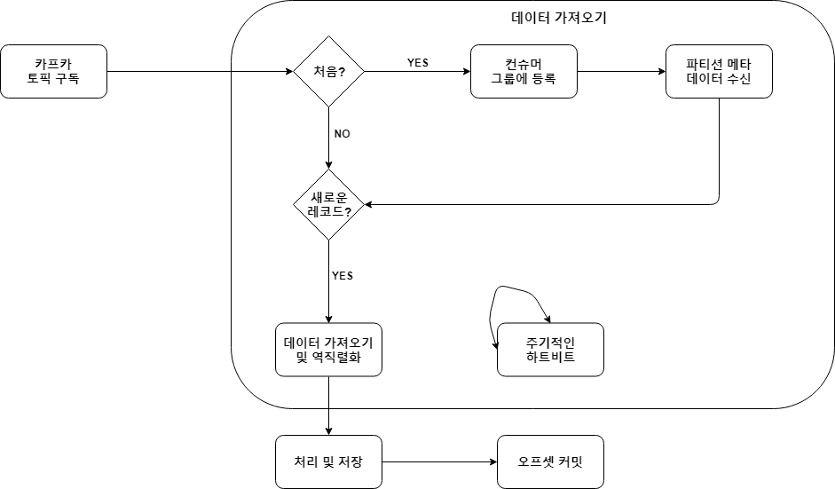
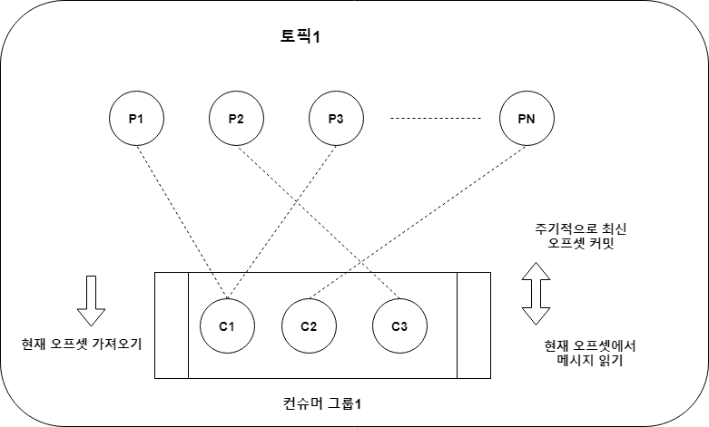

# 04. 카프카 컨슈머  


## 목표  

- <a href="#컨슈머_내부구조">카프카 컨슈머 내부 구조</a>
- <a href="#컨슈머_API">카프카 컨슈머 API</a>
- <a href="#컨슈머_자바">자바 카프카 컨슈머 예제</a>
- <a href="#컨슈머_사용유형">일반적인 메시지 사용 유형</a>
- <a href="#컨슈머_모범사례">모범 사례</a>  

---  

<div id="컨슈머_내부구조"></div>

> ### 카프카 컨슈머 내부 구조  

=> 카프카 큐에서 메시지 사용은 다른 메시징 시스템과 차이가 있지만, 컨슈머 API를 사용하여  
작성할 때는 대부분의 세부 사항이 추상화 됨  

**카프카 컨슈머의 역할 이해**  

- **토픽 구독하기**  
; 컨슈머 동작은 토픽을 구독하면서 시작  
=> 컨슈머가 컨슈머 그룹의 일부인 경우, 해당 토픽의 파티션 하부 세트가 할당  
- **컨슈머 오프셋 위치**  
; 카프카는 다른 큐와는 다르게 메시지 오프셋을 보유하지 않음  
=> 모든 컨슈머는 자신의 오프셋을 유지 할 책임을 가짐  
=> 컨슈머 오프셋은 컨슈머 API를 사용해 유지 됨  
(오프셋을 커밋하는 커스텀 로직 작성도 가능)  
- **재연/되감기(rewind)/메시지 스킵(skip)**  
; 카프카 컨슈머는 토픽 파티션에서 메시지를 읽는 시작점의 오프셋에 대한 전체적인 제어권을 가짐  
- **하트비트(heartbeat)**  
; 지정된 파티션의 멤버십과 소유권을 확인하기 위해 카프카 브로커(컨슈머 그룹 리더)로 하트비트  
신호를 주기적으로 보내는 것은 컨슈머가 책임지는 역할  
=> 정해진 시간 간격으로 그룹 리더가 하트비트를 수신하지 못하면, 파티션 소유권은 컨슈머 그룹 안의  
다른 컨슈머에게 다시 할당  
- **오프셋 커밋**  
;카프카 컨슈머 애플리케이션이 읽는 메시지의 위치나 오프셋을 관리하지 않음  
=> 자신의 파티션 오프셋과 커밋을 관리하는 것은 컨슈머 애플리케이션의 역할  
장점1) 개별 컨슈머 오프셋을 관리하지 않으므로 브로커 성능 향상  
장점2) 컨슈머 APP 특정 시나리오에 맞게 자신의 오프셋을 관리하는 유연성을 갖음  
=> 배치 처리를 마치면서 오프셋을 커밋할 수 있고, 매우 큰 배치를 처리하는 중간에도  
리밸런스(rebalance) 부작용을 줄이기 위해 오프셋을 커밋할 수 있음  
- **역직렬화 deserialization**  
; 카프카 프로듀서는 바이트 배열로 객체를 직렬화  
=> 카프카 컨슈머는 객체를 바이트 배열로 역 직렬화  

   


**폴 루프(poll loop)**  

=> 카프카에서 메시지를 사용하는 첫 단계는 토픽의 구독  
=> 컨슈머 애플리케이션은 하나 이상의 토픽에 대해서 구독 부터 함  
=> 그 다음 애플리케이션은 레코드를 가져오기 위해 카프카 서버를 조사  
=> 이러한 반복 과정은 서버 조정, 레코드 획득, 파티션 리밸런스 ,컨슈머 하트비트 유지 등을 관리  

=> 메타데이터를 받은 컨슈머는 파티션에 할당된 해당 브로커에서 데이터를 가져오기 시작  
=> 새로운 레코드가 발견되면 레코드를 가져오고 역직렬화  
=> 레코드를 최종적으로 처리하고, 기본적인 데이터 유효성 검증을 하고 나면, 일종의 외부 저장소 시스템에  
저장  
=> 극히 일부의 경우에는 레코드를 런타임처리하고 외부 애플리케이션에 전달  
=> 최종적으로 컨슈머는 성공적으로 처리된 메시지 오프셋을 커밋

---  

<div id="컨슈머_API"></div>

> ### 카프카 컨슈머 API  

- 컨슈머 설정
- 카프카 컨슈머 객체
- 구독 및 폴링
- 커밋과 오프셋
- 추가 설정  

#### 컨슈머 설정  
;카프카 컨슈머를 생성하려면 몇 가지 필수 속성이 필요  

- **bootstrap.servers**  
; 카프카 브로커의 IP 주소 목록  
- **key.deserializer**  
; 키를 역직렬화 하기 위해 사용  
=> 프로듀서의 키 시리얼라이저와 대응되어야 함  
- **value.deserializer**  
; 메시지를 역직렬화 하기 위해 사용  
=> 시리얼라이저와 대응되여야 함  
- **group.id**  
=> 필수는 아니지만 사용을 권장  
=> APP 생성 시에 컨슈머 그룹을 정의하는 것은 필요에 따라 컨슈머를 관리하고  
성능을 향상시키는데 도움이 됨  

> Consumer example (java)  

```
import java.util.Properties;
import org.apache.kafka.clients.consumer.KafkaConsumer;

...

Properties consumerProperties = new Properties();
consumerProperties.put("bootstrap.servers", "");
consumerProperties.put("group.id", "Demo");
consumerProperties.put("key.deserializer", "org.apache.kafka.common.serialization.StringDeserializer");
consumerProperties.put("value.deserializer", "org.apache.kafka.common.serialization.StringDeserializer");

KafkaConsumer<String, String> consumer = new KafkaConsumer<>(consumerProperties);
```  

- Properties 객체 : 컨슈머 속성을 초기화 하는데 사용  
- Deserializer : 바이트 배열을 필요한 객체로 변환하는데 어떤 시리얼라이저 클래스가 사용되는지 알려줌  
- KafkaConsumer : 속성이 설정되면 컨슈머 객체를 생성할 수 있음  
=> 컨슈머 객체에 연결할 브로커 IP, 컨슈머가 속하게 될 그룹명, 사용할 역직렬화 클래스, 커밋하면서 사용 할  
오프셋 운영 방안을 알려줌  

#### 구독과 폴링  
; 컨슈머는 데이터를 받기 위해 토픽을 구독함.  

- public void subscribe(Collection<String> topics)  
; 등록을 원하는 토픽 이름의 목록을 전달  
=> 메시지 데이터 처리에 영향을 줄 수 있는 기본 리밸런서(default rebalancer)를 사용  
- public void subscribe(Pattern pattern, ConsumerRebalanceListener listener)  
; 카프카에 존재하는 적합한 토픽을 대응시키는 정규식을 사용 & 이는 동적으로 처리  
=> 정규식에 대응하는 새로운 토픽의 추가나 삭제 시에 리밸런서를 트리거함  
- public void subscribe(Collection<String> topics, ConsumerRebalanceListener listener)  
; 토픽의 목록을 전달하고 ConsumerRebalanceListener를 수반  

#### 커밋 처리와 폴링  
; 폴링은 카프카 토픽에서 데이터를 가져오는 것  
=> 컨슈머는 최근 읽은 메시지를 저장 & 장애 시 다음 오프셋부터 재개  

- **자동 커밋**  
; 컨슈머 설정의 기본 값  
=> 설정된 주기에 따라 최근에 읽은 메시지의 오프셋을 자동으로 커밋  
e.g) enable.auto.commit=true & auto.commit.interval.ms=100 이면  
매초마다 오프셋을 커밋  
=> interval이 10초이고 7초 후 장애가 발생하면 중복 작업 진행  

- **현재 오프셋 커밋**  
; api를 이용해서 특정 시점에 커밋  
=> enable.auto.commit=false & commitSync() 메소드를 사용해 컨슈머 스레드에서 커밋할 오프셋을 호출  
=> ConsumerRecord의 모든 인스턴스를 처리한 후 이메소드를 호출하는 것이 좋음  
=> 그렇지 않으면 컨슈머에 장애가 발생하는 경우 레코드가 손실되는 위험  

> Java example  

```
while (true) {
    ConsumerRecords<String, String> records = consumer.poll(2);
    for (ConsumerRecord<String, String> record : records) {
        SimpleLogger.println("offset = {}, key = {}, value : {}", record.offset(), record.key(), record.value());
    }

    try {
        consumer.commitSync();
    } catch (CommitFailedException e) {
        SimpleLogger.error("Failed to commit", e);
    }    
}
```  

- **비동기 커밋**  
; 동기 방식의 문제점은 카프카 서버에서 커밋 오프셋 요청에 대한 ACK의 수신이 없는 경우,  
컨슈머는 대기 상태가 되는 것(처리 속도가 좋지 않음)  
=> 비동기에도 오프셋 순서가 변경되는 몇몇 경우에는 메시지 중복이 발생  

```
while(!Thread.currentThread().isInterrupted()) {
    ConsumerRecords<String, String> records = consumer.poll(2);
    for (ConsumerRecord<String, String> record : records) {
        SimpleLogger.println("offset = {}, key = {}, value : {}", record.offset(), record.key(), record.value());
        COUNT_DOWN_LATCH.countDown();
    }

    try {
        consumer.commitAsync(new OffsetCommitCallback() {
            @Override
            public void onComplete(Map<TopicPartition, OffsetAndMetadata> map, Exception e) {

            }
        });
    } catch (CommitFailedException e) {
        SimpleLogger.error("Failed to commit", e);
    }
}
```  

=> 동기 & 비동기를 조합해서 사용하는 것이 가장 좋음  
=> 비동기 방식은 데이터를 가져오는 호출에 이어서 사용해야 하고, 동기 방식은 리밸런서의 트리거나  
일부 상황에서 컨슈머를 종료하는 등의 동작에 사용해야 함  


#### 추가 설정  

- enable.auto.commit  
; 설정된 주기에 따라 메시지 오프셋을 자동으로 커밋  
=> auto.commit.interval.ms 설정에서 주기를 정의할 수 있음  
=> 오프셋 커밋 시점을 제어하기 위해서는 이 값을 false로 하면, 중복 작업을 피하고
처리할 데이터를 놓치는 일이 없도록 지원함  

- fetch.min.bytes  
; 데이터 읽기 요청에 대한 카프카 서버의 회신(return)을 요구하는 최소한의 바이트 크기  

- request.timeout.ms  
; 컨슈머가 요청을 재전송하거나 최대 재시도 수에 도달해서 실패하기 전에, 컨슈머가 요청에 대한  
응답을 기다리는 최대 시간  

- auto.offset.reset  
; 컨슈머가 값을 읽어올 파티션에 대한 유효한 오프셋이 없을 때 사용  
  - lastest  
    ; 컨슈머가 시작되는 시점에 가용한 파티션에서 가장 최근 메시지부터 시작하게 됨
  - earliest  
    ; 컨슈머가 해당 파티션의 처음부터 데이터 읽기를 시작하게 하며, 이는 파티션으로부터  
    모든 데이터를 읽는다는 것을 의미
  - none  
    ; 컨슈머에게 예외를 발생시키는 것을 의미  

- session.timeout.ms  
; 컨슈머가 동작 중임을 알리고, 리밸런서를 트리거하는 것을 막기 위해 컨슈머 그룹 코디네이터에게  
하트비트를 전송  

- max.partition.fetch.bytes  
; 서버에서 파티션마다 할당할 최대 데이터 크기  
=> ConsumerRecord 객체에 대해 컨슈머가 필요로 하는 메모리는 파티션 수 X 설정값 보다 커야 함  
=> 10개 파티션 / 1개 컨슈머 / max.partition.fetch.bytes 2MB  이면
   컨슈머는 컨슈머 레코드를 위해 10 x 2 = 20MB 가 필요  

=> 이러한 설정 작업 이전에 데이터를 처리하기 위해 컨슈머가 얼마의 시간을 필요로 하는지 알아야 함  
=> 그렇지 않으면 컨슈머 그룹에 하트비트를 전송할 수 없어 리밸런서를 트리거 하게 됨  
=> 세션 타임아웃을 늘리거나 컨슈머가 최대한 신속하게 처리할 수 있도록 페치 크기를 줄이는 방법이 있음  


---

<div id="컨슈머_자바"></div>

> ### 자바 카프카 컨슈머  


```
package ch04;

import java.util.Arrays;
import java.util.Map;
import java.util.Properties;
import java.util.Random;
import java.util.concurrent.CountDownLatch;
import java.util.concurrent.Future;
import java.util.concurrent.TimeUnit;
import org.apache.kafka.clients.consumer.ConsumerRecord;
import org.apache.kafka.clients.consumer.ConsumerRecords;
import org.apache.kafka.clients.consumer.KafkaConsumer;
import org.apache.kafka.clients.consumer.OffsetAndMetadata;
import org.apache.kafka.clients.consumer.OffsetCommitCallback;
import org.apache.kafka.clients.producer.KafkaProducer;
import org.apache.kafka.clients.producer.ProducerRecord;
import org.apache.kafka.clients.producer.RecordMetadata;
import org.apache.kafka.common.TopicPartition;
import util.SimpleLogger;

public class DemoConsumer {

    private static final String BOOTSTRAP_SERVERS = "192.168.5.78:9092";
    private static final String TOPIC = "consumer-test2";
    private static final CountDownLatch COUNT_DOWN_LATCH = new CountDownLatch(10);


    public static void main(String[] args) {

        Properties consumerProperties = new Properties();
        consumerProperties.put("bootstrap.servers", BOOTSTRAP_SERVERS);
        consumerProperties.put("group.id", "Demo_Group");
        consumerProperties.put("key.deserializer", "org.apache.kafka.common.serialization.StringDeserializer");
        consumerProperties.put("value.deserializer", "org.apache.kafka.common.serialization.StringDeserializer");

        consumerProperties.put("enable.auto.commit", "true");
        consumerProperties.put("auto.commit.interval.ms", "1000");
        consumerProperties.put("session.timeout.ms", "30000");

        KafkaConsumer<String, String> kafkaConsumer = new KafkaConsumer<>(consumerProperties);
        kafkaConsumer.subscribe(Arrays.asList(TOPIC));

        try {
            while (!Thread.currentThread().isInterrupted()) {
                ConsumerRecords<String, String> records = kafkaConsumer.poll(500);
                for (ConsumerRecord<String, String> record : records) {
                    SimpleLogger.println("offset = {}, key = {}, value = {}", record.offset(), record.key(), record.value());
                    COUNT_DOWN_LATCH.countDown();
                }

                kafkaConsumer.commitAsync(new OffsetCommitCallback() {
                    @Override
                    public void onComplete(Map<TopicPartition, OffsetAndMetadata> map, Exception e) {
                        if (e != null) {
                            SimpleLogger.println("Exception occur while commit offset", e);
                        }
                    }
                });

                if (COUNT_DOWN_LATCH.getCount() < 1) {
                    break;
                }
            }
        } catch (Exception e) {
            SimpleLogger.error("Exception occur while consume", e);
        } finally {
            try {
                kafkaConsumer.commitSync();
            } finally {
                kafkaConsumer.close();
            }
        }
    }  
}
```  

#### 리밸런스 리스너  
; 컨슈머를 컨슈머 그룹에 추가하거나 제거하는 경우, 카프카는 리밸런서를 트리거하고 컨슈머는 현재 파티션의  
소유권을 잃음(앞 챕터)  
=> 파티션이 컨슈머에게 다시 할당될 때 중복 처리가 발생  
=> 데이터 연결 관리, 파일 관리, 컨슈머 일부인 캐시 관리 같은 여러 운영 작업이 있으며 파티션이 소유권을 읽기 전에  
이러한 작업을 처리하길 원할 수 있음  
=> onPartitionsRevoked() | onPartitionsAssigned() 메소드를 보유한 ConsumerRebalanceListener 제공  

```
import java.util.Collection;
import org.apache.kafka.clients.consumer.ConsumerRebalanceListener;
import org.apache.kafka.common.TopicPartition;

public class DemoRebalancer implements ConsumerRebalanceListener {

    @Override
    public void onPartitionsRevoked(Collection<TopicPartition> collection) {
        // TODO :: Things to Do before your partition got revoked
    }

    @Override
    public void onPartitionsAssigned(Collection<TopicPartition> collection) {
        // TODO :: Things to do when new partition get assigned
    }
}
```  

---   

<div id="컨슈머_사용유형"></div>  

> ### 일반적인 메시지 사용 유형  

- 컨슈머 그룹 - 연속적인 데이터 처리(continuous data processing)  
  

; 컨슈머가 생성되면 토픽을 구독하고 현재의 오프셋에서 메시지 수신을 시작  
=> 컨슈머는 설정된 주기에 맞게 배치 안에 수신된 메시지 수를 기반으로 최근 오프셋을 커밋  
=> 여기서 핵심은 컨슈머가 메시지 흐름을 제어하지 않음(컨슈머 그룹 파티션에서 현재 오프셋에 의해 운영)  
=> 장점은 적은 양의 코드로 컨슈머 애플리케이션을 완성하고, 버그 위험이 적은 기존 컨슈머 API에 의존하는 점  

- 컨슈머 그룹 - 개별 데이터 처리(discrete data processing)  
  

=> 메시지를 사용하는 데 더 많은 제어를 원할 수 있음  
=> 메시지의 특정 오프셋 읽기를 원하거나 특정 파티션에서 최근의 현재 오프셋을 원하기도 함  
=> 주기적으로 받은 최신 오프셋이 아니라 특정 오프셋을 커밋하기를 원하기도 함(개별 데이터 처리)  
=> 컨슈머는 제공된 오프셋을 사용해 데이터를 가져오고 애플리케이션의 요구에 따라 특정 오프셋을 커밋  
e.g) 카프카에서 이벤트를 읽고 데이터를 처리하여 NoSQL에 저장  
=> 같은 결과를 두 번 저장하지 않을 때, 특정 메시지를 스킵?  


---  

<div id="컨슈머_모범사례"></div>  

> ### 모범 사례  

- **예외 처리**  
; 컨슈머 어플리케이션은 여러 예외 클래스를 정의하고, 업무적인 요구 사항에 따라서 취해야 할 동작을  
결정해야 한다  

- **리밸런스 관리**  
=> 새로운 컨슈머가 그룹에 합류 OR 종료 되면 파티션 리밸런스가 트리거 됨  
=> 컨슈머가 해당 파티션의 소유권을 읽을 때마다 카프카에서 수신한 가장 최근 이벤트의  
오프셋을 반드시 커밋해야 함  

- **제때 오프셋 커밋하기**  
=> 메시지에 대한 오프셋을 커밋할 때는 제때 수행해야 함  
=> 반드시는 아니지만 처리 시간이 1분이 넘는다면, 애플리케이션의 장애 발생 시 데이터 처리가 중복  
되는 것을 막기위해 주기적으로 커밋해야 함  

- **자동 오프셋 커밋**  
=> 중복되는 레코드 처리에 대한 염려가 없거나, 컨슈머가 자동으로 오프셋을 커밋하도록 관리하기를 바라는 경우  
=> 자동 커밋 주기가 10초 이고 7초에서 장애가 발생 한 경우, 7초 동안 오프셋은 커밋되지 않았고, 장애 이후에  
복구가 되면 그 7초 동안의 레코드를 다시 처리  

- 커밋 처리와 폴링 절에서 메시지를 가져오는 poll 함수의 호출은 항상 이전 호출에 대한 최신 오프셋을 커밋  
=> 이런 경우 반드시 기존 호출에서의 모든 메시지가 성공적으로 처리됐어야 함  
