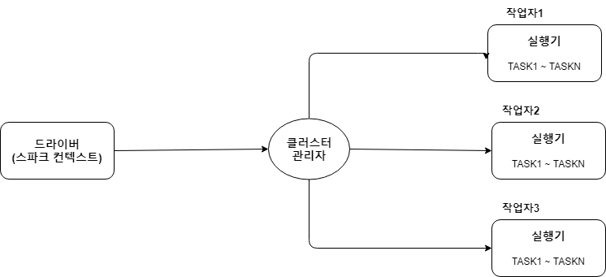
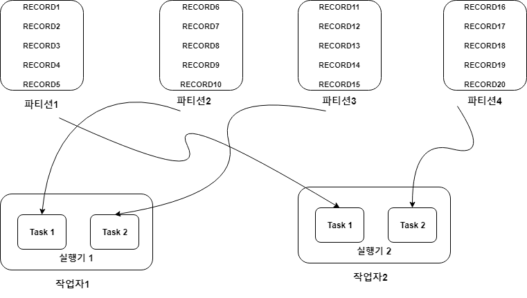

## 05. 카프카 스파크 스트리밍 애플리케이션 개발  

### Index  

- <a href="#스파크_소개">스파크 소개</a>
- <a href="#스파크_핵심요소">RDD 같은 스파크 내부 구조</a>
- <a href="#스파크_스트리밍">스파크 스트리밍</a>
- <a href="">수신자 기반 접근 방식 스파크-카프카 통합</a>
- <a href="">직접 접근 방식 스파크-카프카 통합</a>
- <a href="">활용 사례(로그 처리)</a>  

---   

<div id="스파크_소개"></div>

> ### 스파크 소개  

=> 분산된 메모리상의 데이터 처리 시스템이며 자바,스칼라,파이썬 등 다양한 API 제공  
=> 반복 iterative 접근을 하는 애플리케이션은 디스크 입출력을 줄임으로써 빨라 질 수 있음  
=> 스파크는 많은 데이터를 메모리에 캐시할 수 있고 데이터 변환처럼 반복 접근 방식을 쓰는  
애플리케이션의 성능이 향상되도록 캐시의 장점을 활용할 수 있음  

**스파크의 구조**  

  

=> 마스터/슬래이브 구조  
=> 마스터인 상주 프로그램(daemons)은 스파크 드라이버  
다중 슬래이브인 상주 프로그램은 실행기(executors)  
=> YARN, Mesos, 스파크 독립 클러스관리자 등 클러스트 관리자로 사용 됨  

**스파크 드라이버**  

- 스파크 컨텍스트(Context)  
; 컨텍스트는 스파크 드라이버에서 생성 됨  
=> 컨텍스트 객체는 애플리케이션 설정을 초기화하는 역할도 함  
- DAG 생성  
; 스파크 드라이버는 RDD(resilient distributed dataset, 복원 분산 데이터 세트) 운영을  
기반으로 계보를 생성해서 DAG(directed acyclic graph, 방향성 비순환 그래프) 스케줄러에  
등록하는 역할을 함  
- 스테이지(stage) 생성  
; 드라이버 안의 DAG 스케줄러는 계보 그래프에 기초한 작업(task)의 스테이지를 생성하는 역할을 한다  
- 작업 스케줄과 실행  
; 작업 스테이지가 생성되면 드라이버 안에서 작업 스케줄러는 클러스터 관리자를 사용해 단위 과업의  
일정을 정하고 그 실행을 제어  
- RDD 메타데이터  
; 드라이버는 RDD의 메타데이터와 해당 파티션을 유지  
=> 파티션에 장애가 발생할 경우 스파크는 파티션이나 RDD를 쉽게 다시 선출  

**스파크 작업자**  
=> 해당 컴퓨터에서 실행 중인 실행기를 관리하고 마스터노드와 통신을 수행하는 역할  

- 백엔드(backend) 프로세스  
; 단위 작업자 노드는 하나 이상의 백엔드 프로세스를 갖음  
=> 각 백엔드 프로세스는 실행기를 시작시키는 역할  
- 실행기  
; 단위 실행기는 작업을 병렬로 진행시키는 역할을 하는 개별 스레드 집합(thread pool)으로 구성 됨  
=> 실행기는 데이터를 지정된 위치나 파일에서 읽고, 처리하고, 쓰는 역할을 함  

<div id="스파크_핵심요소"></div>

**스파크의 핵심 요소**  

> 복원 분산 데이터 세트(RDD)  



=> RDD는 스파크의 중심축  
=> RDD는 변하지 않으며 내결함성을 갖는 분산된 객체의 집합  
=> RDD는 논리적인 파티션으로 구분되며 여러 작업자 컴퓨터에 의해 산출 됨  
=> 요약하면 스파크에서 어떤 파일을 읽을 경우, 해당 파일의 데이터는 하나의 큰 RDD를 형성함  
=> RDD상에서 필터링 작업은 새로운 RDD를 갖게 됨(RDD를 수정할 때마다 새로운 RDD를 갖게 됨)  
=> RDD는 파티션이라는 논리적 구역으로 구분되며, 스파크에서의 병렬 처리가 됨  

**RDD상에서 수행되는 두 가지 유형의 작업**  

- 변환  
; RDD상에서의 변환은 또 다른 RDD를 생성  
=> 변환은 필터를 적용하거나 기존의 RDD를 수정하는 것이며 이는 새로 RDD를 생성하게 됨  

- 액션  
; 액션의 운영은 스파크에 대해 실행 트리거 역할을 함  
=> 스파크는 RDD에 대해 수동적(액션을 만나지 못하면 실행 자체를 시작X)  
=> 액션은 파일로 결과를 저장하거나 콘솔에 결과를 출력하는 등의 작업  

> DAG  

=> RDD는 변환이 가능하며 그 결과는 새로운 RDD를 생성하는 것이고, 이 과정은 어떤 액션을 실행하기 까지  
계속 진행 됨  
=> 어떤 액션을 만날 때마다 스파크는 DAG를 생성하고 나서 스케줄러에 등록  

> 단어의 수를 새는 예제  

```
val conf = new SparkConf().setAppName("wordCount")
val sc = new SparkContext(conf)
val input = sc.textFile(inputFile)
val words = input.flatMap(line => line.split(" "))
val word_counts = words.map(word => (word,1)).reduceByKey{case (x,y) => x + y}
word_counts.saveAsTextFile(outputFile)
```  

=> DAG가 등록되면 DAG 스케줄러는 연산자를 써서 작업 단계를 생성함  
=> 작업 스케줄러는 클러스터 관리자와 작업자 노드의 도움을 받아 이 작업을 시작  

**스파크의 운영 환경**  
=> 스파크는 실시간 처리, 머신 러닝, 그래프 처리 등 다양한 목적으로 활용될 수 있음  
=> 스파크는 그 용도에 따라 다양한 독립적인 구성 요소로 이뤄짐  

  
(https://i2.wp.com/www.jenunderwood.com/wp-content/uploads/2016/10/SparkArchitecture-Databrickss.gif?fit=800%2C462&ssl=1)  

- 스파크 코어  
; 스파크 운영환경에서 기초가 되는 범용적인 계층  
=> RDD도 코어 계층의 일부  
=> 작업 스케줄러, 메모리 관리자, 내결함성, 저장소 상호 작용 계층(storage interaction layer) 등의  
공통 구성 요소도 스파크 코어의 일부  
- 스파크 스트리밍  
; 실시간 스트리밍 데이터 처리에 사용
- 스파크 SQL  
; SQL 같은 질의어를 JSONRDD와 CSVRDD 같은 구조화된 RDD상에서 활용하도록 API 제공  
- 스파크 MLlib  
; MLlib는 스파크에서 확장성 있는 머신 러닝 솔루션을 생성하는데 사용 됨  
=> 회귀(regression) , 분류작업(classfication), 클러스터나 필터링 같은 풍부한 머신 러닝 알고리즘 세트 제공  
- 스파크 GraphX  
; GraphX는 복잡한 사회관계망을 기반으로 추천 엔진을 제작하는 등의 그래프 처리가 중요한 역할을  
하는 상황을 다루는데 활용  

---  

<div id="스파크_스트리밍"></div>

> #### 스파크 스트리밍


---  


<br /><br /><br /><br /><br /><br /><br /><br />
